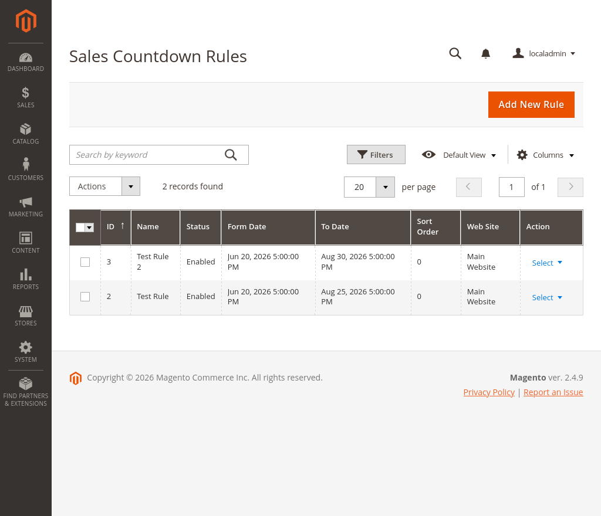
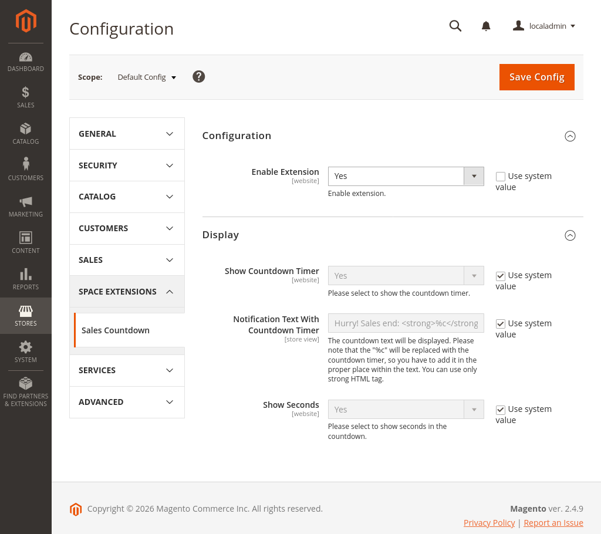

# **Magento 2 Sales Countdown Extension** #

[](https://github.com/AttilaSagiDev/sales-countdown/actions/workflows/codesniffer-actions.yml)

## Description ##

The extension adds functionality to show a sales countdown timer on the product view page for specific products. The administrator can create custom rules with specific conditions for product selection. The functionality of these rules is very similar to the built-in Magento 2 Catalog Price Rules. The rules for this module are accessible to the administrator in the **Marketing > Sales Countdown Rules** grid, operating as a separate, custom grid within the admin panel.

## Images ##





## Features ##

- Module enable / disable
- Select to show or not the countdown timer
- Customize the default notification text
- Select to show seconds or not
- Custom admin grid for different rules for the product collections
- Ability to overwrite the configured notification text by rules
- Multistore support
- Supported languages: English

It is a separate module that does not change the default Magento files.

Support:
- Magento Community Edition 2.4.x
- Adobe Commerce 2.4.x

## Installation ##

** Important! Always install and test the extension in your development environment, and not on your live or production server. **

1. Backup Your Data Backup your store database and the whole Magento 2 directory.

2. Enable extension Please use the following commands in your Magento 2 console:

   ```
    bin/magento module:enable Space_SalesCountdown

    bin/magento setup:upgrade
    ```

## Configuration ##

Log in to Magento backend (admin panel). You can find the module configuration here: Stores / Configuration, in the left menu Space Extensions / Sales Countdown.

Settings:

### Configuration ###

Enable Extension: Here you can enable the extension.

### Display ###

Show Countdown Timer: Please select to show the countdown timer.

Notification Text With Countdown Timer: Please enter the text that will be displayed in the notification.

Show Seconds: Please select to show the seconds or not.

## Change Log ##

Version 1.0.0 - Aug 22, 2026
- Compatibility with Magento Community Edition 2.4.x
- Compatibility with Adobe Commerce 2.4.x

## Support ##

If you have any questions about the extension, please get in touch with me.

## License ##

MIT License.
